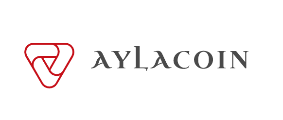
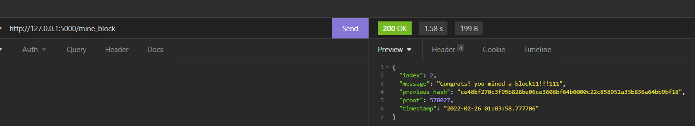
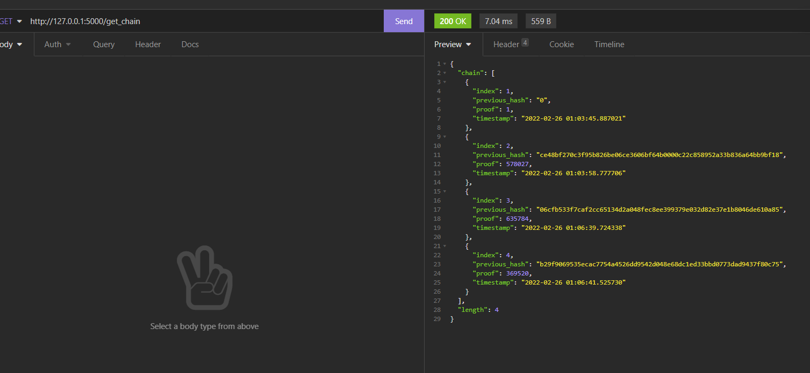
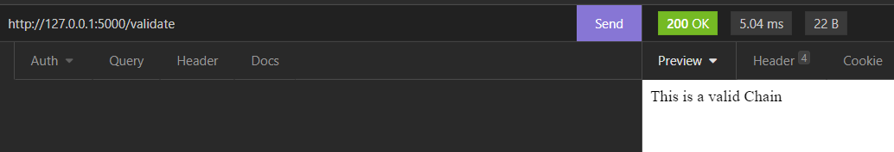
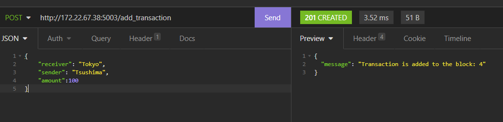
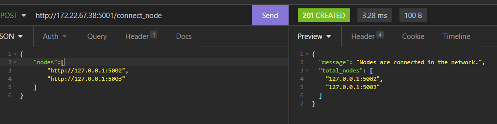
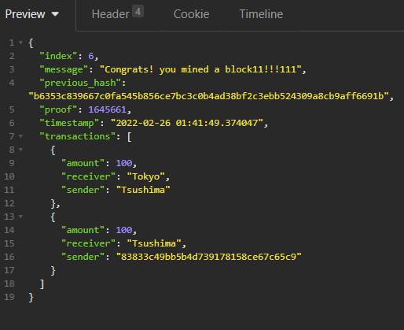

 

# MVP

An experimental blockchain creation, mining, verification excersize.

Also on top of that is build `AylaCoin` where `decentralized` nodes in the network can exchange `AylaCoin` with each other.

### Mock Data

in the mock/*.json files, you can find the mock data for the nodes and the transaction format.

# blockchain.py

This is the core blockchain logic where the AylaCoin is based on.

## Dependencies

Flask
requests

## App URL

`http://0.0.0.0:5000/${endpoint}`

## endpoints

-> `/mine_block`
 
-> `get_chain`
 
-> `validate`

## Functionalities

### mine_block

When a request is made to the endpoint '/mine_block', the node creates a new block and adds it to the chain. Minings is expected to be completed once the first 5 digits of the `hashlib.sha256(str(current_proof**2-previous_proof**2 - 2**10).encode()).hexdigest()` function are equal to '00000`.

### get_chain

When a request is made to the endpoint '/get_chain', the node returns the entire chain and also the length of the chain. If no mining is made before the request, the chain will only show the `genesis` block.

## validate

using the validate endpoint, the node will check if the chain is valid or not.

# AylaCoin.py

 Basically an experimental custom cryptocurrency based on the blockchain.py implementation above. 

## endpoints

-> `/add_transaction`  ==> POST request
 
given the parameters `sender` and `recipient` and `amount`, the node will create a new transaction and add it to the list of transactions.

 

-> `/connect_node`  ==> POST request

 
Takes the nodes from a JSON file (mock data is used), checks whether the json file actually contains any adresses.
If there is at least one address, the node will connect to the node and add it to the list of nodes hence forming a network.

 

-> `/replace_chain`  ==> GET request

replaces the chain with the longest chain in the network.

<h2>Finalized Transaction Screenshot</h2>

 

<h4> beware the sender and receiver which shows that the nodes are connected, the consensus is established and transactions are successfully made</h4>

 

